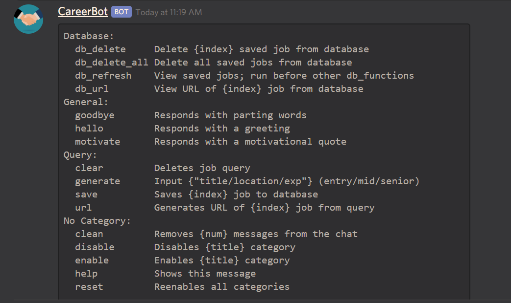

# CareerBot
A Discord bot aimed to help aspiring developers (or any job seekers in any industry) identify available job postings based on user criteria and save them for future use. All scraped job data comes from Indeed.com. 

Feel free to play around with it in a test server: https://discord.gg/eGWQJqU (Requires a Discord account)

# Installation
### Dependencies
* <b>bs4</b>: Used to scrape motivational quotes / job postings.
* <b>discord</b>: Used to access [Discord's API](https://discordpy.readthedocs.io/en/latest/index.html).
* <b>pandas</b>: Used to store/organize scraped data.
* <b>pickle</b>: Serializes pandas dataframes to use between functions.
* <b>sqlite3</b>: Stores job postings for user.

The latest versions of the above (as of 11/19/2019) and Python 3.8.0 are what I've used to write up this bot.

### Other
Create your own credentials file for the bot's token and save it in the main directory. Tokens can be generated from the developer tools within Discord.

# Usage

CareerBot functions are split into three primary categories: 
* <b>General</b>: Basic commands to talk to CareerBot.
* <b>Query</b>: Commands regarding the generation of job results based on given criteria.
* <b>Database</b>: Commands used to access and/or delete saved job results from prior queries.

Functions are called using "-function."

<i>For example</i>: <b>-hello</b> --> Returns a greeting. 

For functions that have {brackets} in their description, ensure that you enter a valid argument after calling the function. 

<i>For example</i>: <b>-generate "software developer/new york/entry"</b> --> Returns job postings that meet the given criteria.

Use -help to reveal all available functions and their arguments if you forget.

# License
